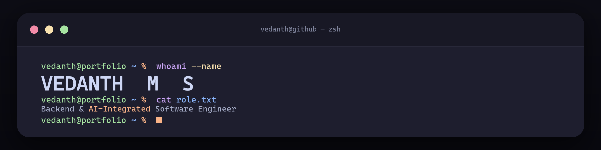
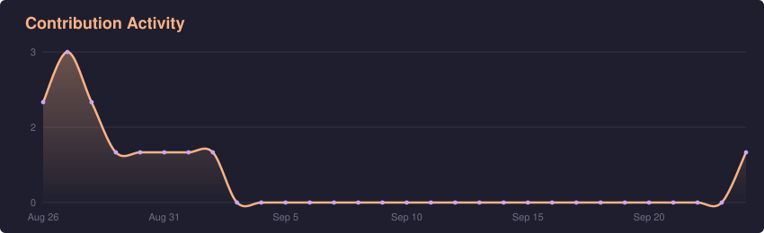
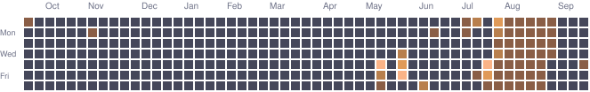

<!--
DIRECTION CONTRACT — Terminal/TUI (centered layout)
THESIS: The profile IS a zsh session. It refuses the badge-wall + hero-card
  template; every section is a command. Centered + contained top to bottom.
OWN-WORLD: Catppuccin Mocha (bg #11111b, base #1e1e2e) with a peach #fab387
  signature; mono is the native medium (real commands), not a costume.
  Header is a rendered terminal window (traffic lights, syntax coloring).
STORY: Visitor reads a backend/AI engineer driving a terminal — lands on the
  name, reads `cat about.txt`, then scans work, stack, activity as commands.
FIRST VIEWPORT: large terminal-window banner — `whoami --name` → VEDANTH M S,
  `cat role.txt` → role, last line TYPES rotating taglines (animated GIF) with
  a blinking peach cursor. Then `cat about.txt`, portfolio link, entry badges.
FORM: user-pinned Terminal/TUI (chosen from three concepts). Banner rendered
  deterministically by assets/banner-src/gen_banner.py (Pillow), not a screenshot;
  animated GIF for the typing loop, static PNG as the <picture> fallback.
-->

<div align="center">

<picture>
  <source media="(prefers-color-scheme: dark)" srcset="./assets/banner-dark.gif">
  <source media="(prefers-color-scheme: light)" srcset="./assets/banner-light.gif">
  
</picture>

</div>

```text
vedanth@portfolio ~ % cat about.txt

  Role ......... Backend & AI-Integrated Software Engineer
  Focus ........ rule engines · dev tooling · agentic systems
  Languages .... Java · Python · TypeScript · C
  Backend ...... Spring Boot · Node.js
  Frontend ..... React · Vite · Tailwind
  Data ......... MySQL · SQLite · Docker · Vercel
  AI ........... Gemini · Ollama · RAG
  Latency ...... decisions in single-digit milliseconds
  Currently .... shipping backend systems end to end
  Open to ...... backend & AI-integrated roles
```

<div align="center">

**[⟶ &nbsp;Step into the interactive 3D portfolio](https://vedanth1101-source.github.io/vedanth-portfolio/)**

<sub>a WebGL room you walk up to, boot a Windows-95 desktop, and explore the work from inside the monitor</sub>

<br>

[](https://vedanth1101-source.github.io/vedanth-portfolio/)
[](https://linkedin.com/in/vedanth-m-s)
[](https://github.com/vedanth1101-source)
[](mailto:vedanth1101@gmail.com)
&nbsp;


</div>

---

### $ ls ~/work

**[sentinelx/](https://github.com/vedanth1101-source/sentinelx)** &nbsp;·&nbsp; `configurable policy decision engine`<br>
Moves business rules out of code and into a database, then evaluates transactions against an in-memory rule set in **single-digit milliseconds** — no database read on the hot path. A lock-free `volatile` cache with synchronized write-through invalidation, strictest-wins severity escalation, and an adversarial stress-test endpoint that measures per-rule coverage. **34 tests.**<br>
<sub>`Java 21` · `Spring Boot` · `React` · `TypeScript` · `MySQL`</sub>

**[BugBuddy/](https://github.com/vedanth1101-source/BugBuddy)** &nbsp;·&nbsp; `AI developer diagnostics`<br>
Turns a raw stack trace into a plain-English diagnosis and a suggested fix with Gemini, keeping a MySQL cache in front so a repeated error never pays for the model twice. Per-IP rate limiting and optional API-key auth guard the one endpoint that spends quota.<br>
<sub>`Java 21` · `Spring Boot` · `React 19` · `Gemini` · `Railway` · `Vercel`</sub>

**[farm-manager/](https://github.com/vedanth1101-source/farm-manager-ai-poc)** &nbsp;·&nbsp; `local-first agentic platform`<br>
Translates plain-English questions into SQL over a local Ollama model, with a deterministic regex fallback for zero-downtime querying, a RAG knowledge base, and autonomous background agents.<br>
<sub>`Java` · `Spring Boot` · `SQLite` · `Ollama` · `RAG`</sub>

---

### $ cat stack.txt

**Languages**<br>


**Backend**<br>


**Frontend**<br>


**Data &amp; Infra**<br>


**AI &amp; Tooling**<br>


`Gemini API` &nbsp;·&nbsp; `Ollama` &nbsp;·&nbsp; `RAG`

---

### $ git log --stat

<div align="center">





</div>

---

### $ ./heatmap 

<div align="center">

<picture>
  <source media="(prefers-color-scheme: dark)" srcset="./assets/heatmap-dark.svg">
  <source media="(prefers-color-scheme: light)" srcset="./assets/heatmap-light.svg">
  
</picture>

</div>


<div align="center">
<sub>vedanth@portfolio ~ % &nbsp;open to backend &amp; AI-integrated software roles&nbsp; · &nbsp;final-year CS @ SSN College of Engineering</sub>
</div>
